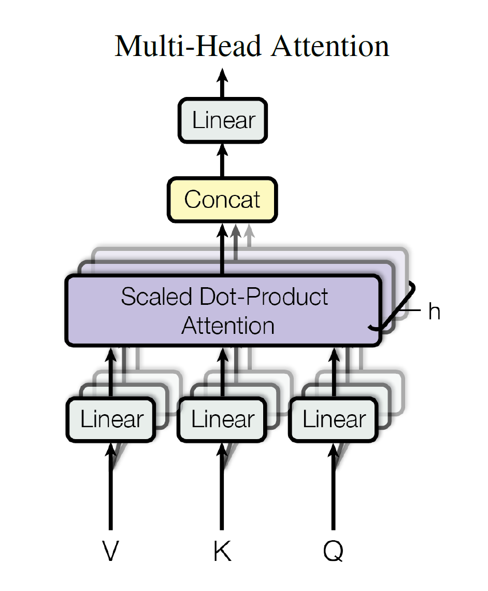
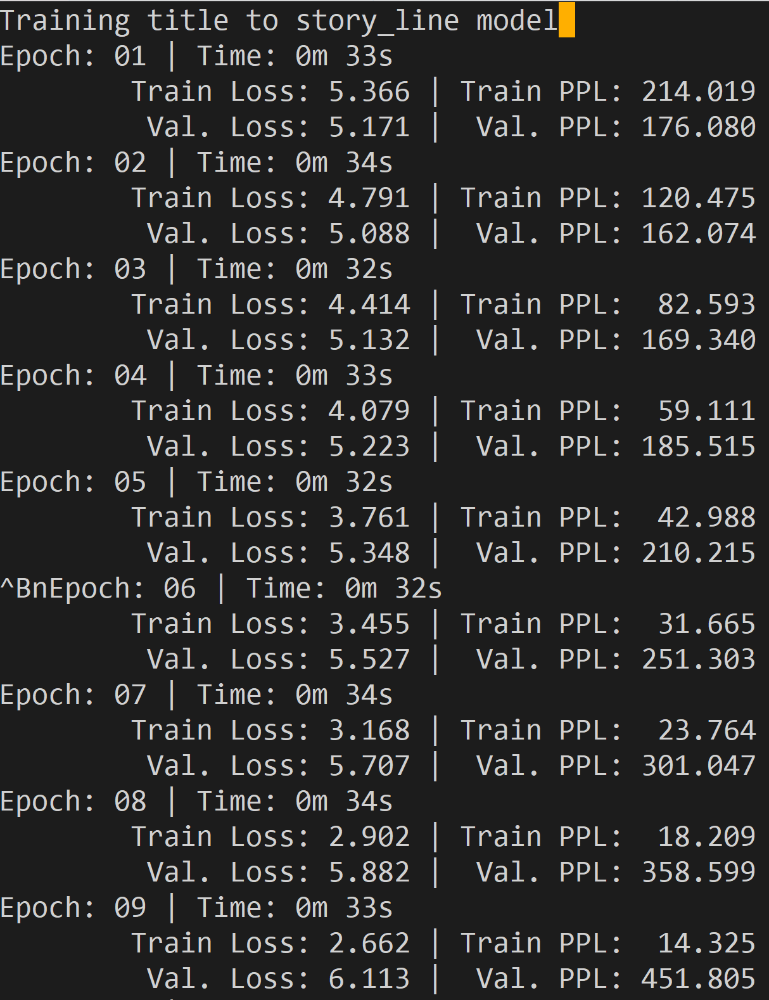
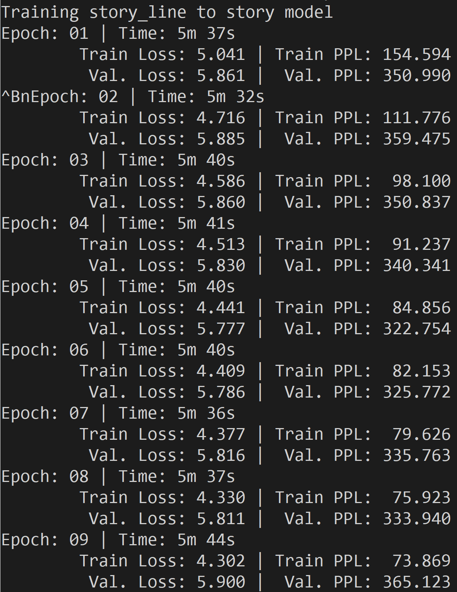

# plan_write

### Introduction

我们力图复现一下论文(Seq2Seq，静态两步式生成)，并尝试加了一些模块(Self-Attention)，以期在本任务上达到较好效果。

### Related Work

本来是想在作者的源码上改一下，加点其他模块。但是看了一下作者的源码，发现作者的源码里有相当多的操作非常迷幻，比如加了很多论文中没有提到的trick(如Weight Drop)，似乎没有在model中用Attention(但论文中明确提到有)等等。另一方面，从代码风格上来讲，作者的源码对我而言确实不够平易近人，难以下手修改。总之，咱也看不懂，咱也不敢问，TAT

于是我们只能把baseline重写一遍。。。

### Our Work (This Repo)

#### Description

按照论文中的描述，所谓Static式生成其实就是两步走，先Seq2Seq生成StoryLine，再Seq2Seq生成Story。本repo也只实现了基本的Seq2Seq(带Attention的)。

在实现过程中，参考了一些网上的风格较好的tutorial，基于pytorch和torchtext等封装较好的库。

#### Usage

- 准备数据
  - 利用RAKE算法抽取关键词不在本repo范围内
  - 原始数据文件名为 /train/valid/test_title_line_story.txt
  - 可运行data_split.py把数据集按照不同的域切分, 保存格式为tsv
    - 如在title to story-line 过程中，只需使用`title`与`story_line`两个域，生成的样例可参见`train_title_line.tsv`

- 在config.py里设置参数，如数据集目录，模型超参数, 训练好的模型保存路径，生成的结果路径等
- 传入上一步config的名字，运行main.py, 可参考 `title2line.sh`和`line2story.sh`
  - 可通过`mode`参数选择是否要进行训练或生成

#### Some Tricks

- Vocabulary截断。本Repo并没有使用预训练好的词向量，而本任务又难以从头开始学到足够好的词向量，尤其是某些低频词。所以我们在构建词典的时候把很多低频词都扔掉了。(如果不扔的话，训练结果会非常差)
- 抑制重复。在生成故事线的过程中，生成的5个词往往会重复，论文中在decode的时候暴力去重，我们也沿用了这样的方法。

#### Advanced Attmpt

考虑到只重写了一个baseline，没有一点儿花里胡哨的东西，面子上总是挂不住滴。由于时间有限，我们也没有尝试加其他更复杂的东西，考虑到model architecture最容易解耦，所以尝试了一个较为花哨的model。

一言以蔽之，我们想把self-attention加到RNN里。self-attention最早被大家熟悉应该是在transformer系列工作中。transformer系列工作完全抛弃了RNN的循环思路，而是采用MutiHeadAttention模块作为基石。我们使用多层RNN作为Encoder，并在RNN层与RNN层之间插入了MutiHeadAttention模块。

#### Experiment

- 复现Baseline

  - 泛化性能差。具体表现在模型稍微一训练就会过拟合。trainset上的loss可以一直下降，但validset上的loss不到5个epoch就到达了最低点并开始上升。这意味着模型的容量很大，足以拟合训练集，但这种拟合是大大牺牲了泛化性能的。

  - 两步的loss如下图所示

    

  - 

  - 可能是由于我们并没有像论文中一样添加了很多trick，所以我们复现的模型的bleu score的结果要比源码差一些

    | Model      | Bleu Score           |
    | ---------- | -------------------- |
    | 作者源码   | 0.011146367604214563 |
    | 我们的代码 | 0.006871091977711924 |

- 加入Self-Attention模块

  - 我们惊奇地发现加入此模块后，训练过程中valid loss不再飘
  - 
  - 目前这部分正在decode。。。。预知结果如何，请等下次commit

